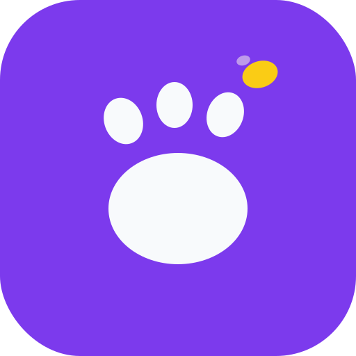

<div align="center">
  
  <h1>LemonClaw</h1>
  <p>Ultra-lightweight AI agent platform for LemonData</p>
  <p>
    
    
  </p>
</div>

LemonClaw is a hard fork of [nanobot](https://github.com/HKUDS/nanobot) (MIT), rebuilt as the AI agent platform for [LemonData](https://lemondata.cc). ~4,200 lines of Python, 300+ AI models via LemonData API, native MCP support, 10 IM channels.

## Quick Start

```bash
# One-line install
curl -fsSL https://raw.githubusercontent.com/hedging8563/lemonclaw/main/deploy/self-hosted/install.sh | bash

# Or manual
pip install lemonclaw
lemonclaw init        # 10-step interactive wizard
lemonclaw gateway     # Start the gateway
```

## CLI Commands

| Command | Description |
|---------|-------------|
| `lemonclaw init` | 10-step interactive setup wizard |
| `lemonclaw gateway` | Start gateway server |
| `lemonclaw agent` | Interactive chat mode |
| `lemonclaw agent -m "..."` | Single message mode |
| `lemonclaw doctor` | Pre-flight diagnostics |
| `lemonclaw doctor --fix` | Auto-fix common issues |
| `lemonclaw status` | Show runtime status |
| `lemonclaw cron add/list/remove` | Scheduled tasks |
| `lemonclaw channels login` | Link WhatsApp (QR scan) |
| `lemonclaw channels status` | Show channel status |
| `lemonclaw provider login <name>` | OAuth login for providers |

## Architecture

```
User Message → Channel (Telegram/Discord/...) → Message Bus → Agent Loop → LLM Provider → Tool Execution → Response
                                                     ↑                          ↑
                                              Session Manager            LemonData API (300+ models)
                                              + Compaction               via LiteLLM routing
```

### Watchdog (3-layer health monitoring)

| Layer | Mechanism | Detects |
|-------|-----------|---------|
| Layer 0 | `signal.alarm(60)` | Event loop blocking (sync call hangs) |
| Layer 1 | In-process asyncio | Memory, stuck sessions, error rate |
| Layer 2 | External (launchd/systemd timer) | Process crash, /health failure |

## Supported Channels

Telegram, Discord, WhatsApp, Feishu, Slack, DingTalk, Email, QQ, Matrix, Mochat, WeCom (企业微信)

## Project Structure

```
lemonclaw/
├── agent/        # Core agent loop, tools, context, memory, subagent
├── bus/          # Message bus (events, queue)
├── channels/     # 10 IM channel integrations
├── cli/          # CLI commands (init, gateway, agent, doctor, cron, status)
├── config/       # Config schema, loader, defaults, sync
├── cron/         # Scheduled tasks
├── gateway/      # HTTP server (Starlette ASGI)
├── heartbeat/    # Periodic heartbeat service
├── providers/    # LLM providers (litellm, openai-codex, custom)
├── session/      # Session manager, token-level compaction
├── skills/       # Built-in skills
├── utils/        # Helpers
├── watchdog/     # Health monitoring, memory backup
├── conductor/    # Multi-agent orchestration
├── cloud/        # Cloud integration interface
├── telemetry/    # Usage tracking
└── memory/       # Memory system (entities, triggers, search)
```

## Configuration

Config file: `~/.lemonclaw/config.json`

LemonData providers are pre-configured by `lemonclaw init`. The 3 provider names:
- `lemondata` — OpenAI-compatible (needs `/v1`)
- `lemondata-claude` — Anthropic-compatible (no `/v1`)
- `lemondata-minimax` — MiniMax native format, Anthropic-compatible (no `/v1`)
- `lemondata-gemini` — Gemini native format (no `/v1`)

## Self-Hosted Deployment

```bash
# macOS: launchd service (auto-configured by init wizard)
launchctl start cc.lemondata.lemonclaw

# Linux: systemd user service (auto-configured by init wizard)
systemctl --user start lemonclaw
```

## K8s Deployment

See `deploy/k8s/` for Kubernetes manifests. Multi-stage Dockerfile at `deploy/k8s/Dockerfile`.


## License

MIT — forked from [nanobot](https://github.com/HKUDS/nanobot) by HKUDS.
